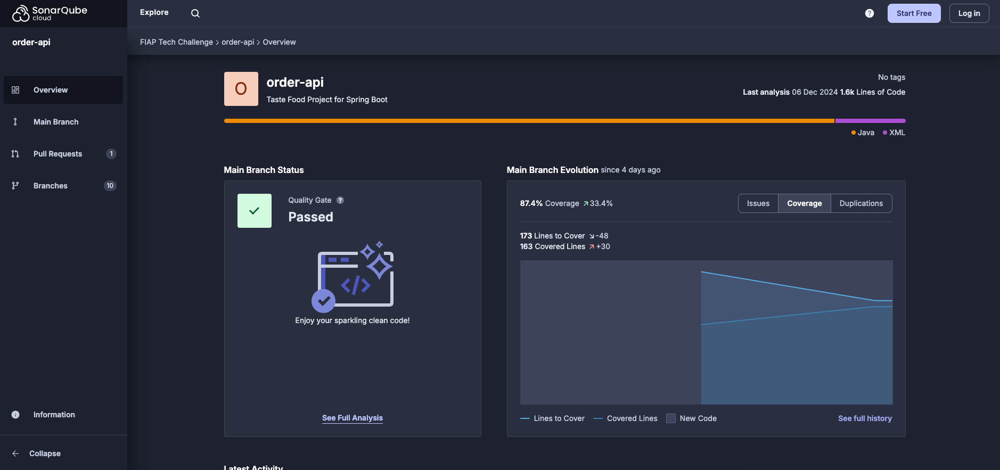

# FIAP Tech Challenge | Pós Tech

## Propósito
Sistema para gestão de produtos e pedidos.

## Stack utilizada
* PostgreSQL
* Java
* Docker
* Kubernetes
* Helm
* K6

## Pré-requisitos
* Ter o Docker instalado para criação e execução das imagens

## Documentação da API REST
Com a aplicação em execução, a documentação da API REST pode ser acessada através da URL: http://localhost:8080/swagger-ui/index.html

## Execução local pelo Docker
Para realizar o build e iniciar a aplicação basta executar o comando abaixo na raiz do projeto:
```bash
docker-compose up
```

## Execução local pelo Minikube
1. Instale o Minikube em sua máquina, seguindo as instruções do site oficial: https://minikube.sigs.k8s.io/docs/start
2. Inicie o Minikube:
```bash
minikube start
```
3. Habilite o metric-server no Minikube, para que o autoscale possa funcionar corretamente:
```bash
minikube addons enable metrics-server
```
4. Instale o Helm, seguindo as instruções do site oficial: https://helm.sh/docs/intro/install/
5. Utilizando o Helm, instale o PostgreSQL no Kubernetes:
```bash
helm install database oci://registry-1.docker.io/bitnamicharts/postgresql --set auth.database=taste_food --set auth.username=taste_food --set auth.password=nSKcUf5Ms9CYQT8jz7kpNA
```
6. Dentro do diretório do projeto, execute o comando passando o diretório `k8s` como parâmetro, assim todos os arquivos dentro dele serão aplicados no Kubernetes:
```bash
kubectl apply -f k8s
```
7. Descubra o IP do Minikube, que precisamos para acessar a aplicação:
```bash
minikube ip
```
8. Se tudo ocorrer normalmente, a aplicação já poderá ser acessada através do IP exibido, na porta 30000.
9. Instale o K6, seguindo as instruções do site oficial: https://grafana.com/docs/k6/latest/set-up/install-k6/
10. Execute o teste de carga na aplicação e será possível observar o autoscale em ação:
```bash
# - O IP utilizado no comando deve ser o IP do Minikube, obtido através dos comandos anteriores.
# - Os parâmetros 'vus' e 'duration' podem ser ajustados de acordo com a carga desejada no teste.
k6 run -e HOSTNAME=192.168.49.2:30000 --vus 100 --duration 30s script.js
```

## Passos para testar API
Abaixo iremos realizar os passos necessários para simular o fluxo básico do sistema. Os comandos estão utilizando o endereço IP do Minikube 192.168.49.2. Esse IP poderá ser diferente na sua máquina e talvez seja necessário substituí-lo, conforme explicamos na seção [Execução local pelo Minikube](#execução-local-pelo-minikube).
1. Cadastrar produtos
```bash
curl --location 'http://192.168.49.2:30000/product' \
--header 'Content-Type: application/json' \
--data '{
  "name": "X-Bacon",
  "description": "Um delicioso hamburguer, com bacon, queijo, tomate, alface e maionese",
  "category": "LANCHE",
  "price": 15.99,
  "images": [
    "https://embutidosbonatti.ind.br/temp/BIN_57_V9Fb0BwK.jpg"
  ]
}'
```
```bash
curl --location 'http://192.168.49.2:30000/product' \
--header 'Content-Type: application/json' \
--data '{
  "name": "Coca-Cola Original 350ml Lata",
  "description": "Coca-cola em lata contendo 350ml, sabor original",
  "category": "BEBIDA",
  "price": 7.99,
  "images": [
    "https://andinacocacola.vtexassets.com/arquivos/ids/158149-1600-auto"
  ]
}'
```

2. Cadastrar pedido (customerId é opcional)
```bash
curl --location 'http://192.168.49.2:30000/order' \
--header 'Content-Type: application/json' \
--data '{
  "customerId": "670104bb-eac6-4bb1-ae7f-df2cdd60d9ba",
  "products": [
    {
      "productId": 1,
      "quantity": 2
    },
    {
      "productId": 2,
      "quantity": 1
    }
  ]
}'
```
3. Realizar o checkout do pedido
```bash
curl --location --request POST 'http://192.168.49.2:30000/order/1/checkout'
```
4. Simular pagamento do pedido aprovado
```bash
curl --location --request PUT 'http://192.168.49.2:30000/order/1/paymentStatus?paymentStatus=APROVADO'
```
5. Visualizar fila de pedidos não finalizados
```bash
curl --location 'http://192.168.49.2:30000/order/queue'
```
6. Atualizar o status do pedido quando preparação for iniciada
```bash
curl --location --request PUT 'http://192.168.49.2:30000/order/1/status?status=EM_PREPARACAO'
```
7. Atualizar o status do pedido quando estiver pronto
```bash
curl --location --request PUT 'http://192.168.49.2:30000/order/1/status?status=PRONTO'
```
8. Atualizar o status do pedido quando for finalizado
```bash
curl --location --request PUT 'http://192.168.49.2:30000/order/1/status?status=FINALIZADO'
```

## Cobertura de código do sistema

Pode ser analisado melhor a cobertura no seguinte link: https://sonarcloud.io/project/overview?id=fiap-tech-challenge-7soat-g13_order-api



Existem outros endpoints no sistema, como alteração e exclusão de produto, listagem de clientes, etc. Para visualização completa sugerimos a acessar o Swagger ou a utilização da collection do Postman.
## Autores
* Cristiano de Barros
* Graziela Göedert de Souza